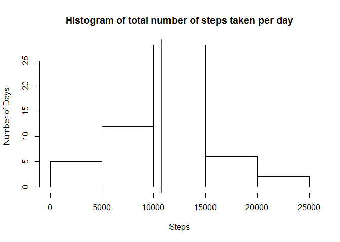
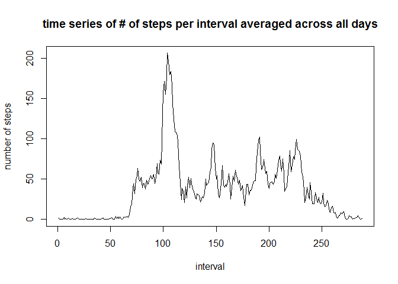
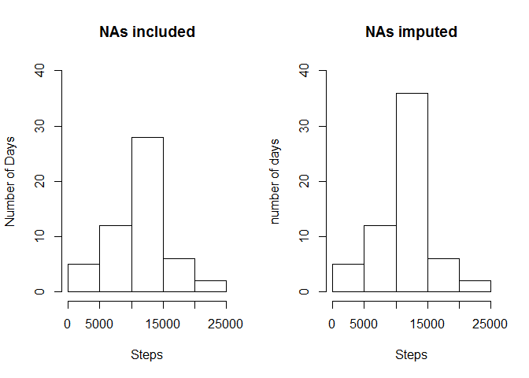
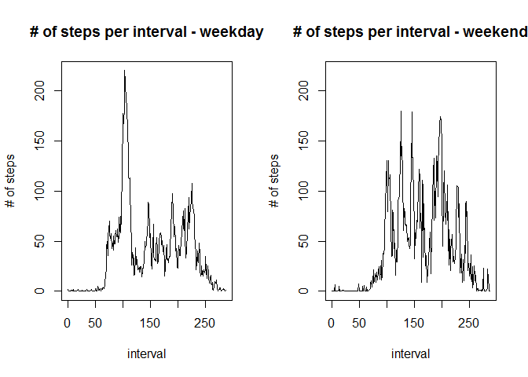

# Reproducible Research: Peer Assessment 1


## Loading and preprocessing the data

First the data is downloaded and unzipped, then it is read into R into the variable "activity":

```r
activity <- read.csv("activity.csv")
```

## What is mean total number of steps taken per day?

Before the mean is calculated, the total number of steps taken per day needs to be found:

```r
sub1 <- tapply(activity$steps, activity$date, sum)
```

A quick summary of this subset shows us that the mean number of steps taken per day is 10770, and that the median number of steps taken per day is 10760:

```r
summary(sub1)
```

```
##    Min. 1st Qu.  Median    Mean 3rd Qu.    Max.    NA's 
##      41    8841   10760   10770   13290   21190       8
```

A histogram of this subset shows that the average number of steps taken per day is indeed around 11000:

```r
hist(sub1, xlab = "Steps", ylab = "Number of Days", main = "Histogram of total number of steps taken per day")
abline(v = mean(sub1, na.rm = TRUE), col = "red")
```

<!-- -->


## What is the average daily activity pattern?

There are a total of 2304 NA values in the "activity" dataset:

```r
sum(is.na(activity$steps))
```

```
## [1] 2304
```

Before we can perform any mean calculations, NAs need to be omitted from the dataset. A new dataset "newact" is created which doesn't contain any NA values:

```r
newact <- na.omit(activity)
```

Using this cleaned dataset, we can then calculate the mean of the number of steps taken per time interval, over all of the days:

```r
sub2 <- tapply(newact$steps, newact$interval, mean)
```

A time series plot shows us the mean value at each time interval for the entire timespan of data collection:

```r
plot(sub2, type = "l", xlab = "interval", ylab = "number of steps", main = "time series of # of steps per interval averaged across all days")
```

<!-- -->

And finally, the time interval in which the most steps are taken on average can be calculated simply by:

```r
which.max(sub2)
```

```
## 835 
## 104
```
Which shows that the "835" time interval is when the most steps are taken on average.

## Imputing missing values

Again, the total number of missing values in the "activity" dataset can be calculated as follows:

```r
sum(is.na(activity$steps) == TRUE)
```

```
## [1] 2304
```

The model that I am choosing to impute these missing values is to fill them in with the calculated average number of steps taken for the accompanying time interval of the missing value.  

First, a copy of "activity" is made which will hold the imputed values:

```r
actfix <- activity
```

This code chunk cycles through every row in the "steps" column of the dataset, checks to see if it contains a missing value, and fills it in with the calculated average of that time interval, which comes from the "sub2" subset which was calculated above.

```r
for(i in 1:length(actfix$steps)){
        if(is.na(actfix[i,"steps"]) == TRUE){
                a <- actfix[i,"interval"] 
                actfix[i,"steps"] <- sub2[paste0(a)]
        }
}
```

The end result is a dataset with all the missing NAs filled in:

```r
summary(actfix)
```

```
##      steps                date          interval     
##  Min.   :  0.00   2012-10-01:  288   Min.   :   0.0  
##  1st Qu.:  0.00   2012-10-02:  288   1st Qu.: 588.8  
##  Median :  0.00   2012-10-03:  288   Median :1177.5  
##  Mean   : 37.38   2012-10-04:  288   Mean   :1177.5  
##  3rd Qu.: 27.00   2012-10-05:  288   3rd Qu.:1766.2  
##  Max.   :806.00   2012-10-06:  288   Max.   :2355.0  
##                   (Other)   :15840
```

A histogram of the imputed dataset is made in much the same way as before, first lumping the data into the total steps per day and then plotting that dataset.

```r
sub3 <- tapply(actfix$steps, actfix$date, sum)
```

The two histograms are shown side by side below:

```r
par(mfrow = c(1,2))
hist(sub1, xlab = "Steps", ylab = "Number of Days", main = "NAs included", ylim = c(0, 40))
hist(sub3, xlab = "Steps", ylab = "number of days", main = "NAs imputed", ylim = c(0, 40))
```

<!-- -->

From the imputed data, we can see that there are many more days in which an average number of steps were taken compared to the unfixed data, which makes sense considering how the NA values were imputed.

## Are there differences in activity patterns between weekdays and weekends?

To calculate the differences in activity between weekdays and weekends, we first need to find out what data came from weekdays and what data came from weekends.  

This code chunk goes through the "date" column in the imputed dataset and checks to see if the date is a weekend (Saturday or Sunday), or a weekday (everything else). It creates a new column called "weekfactor" in the dataframe which contains this information. 

```r
for(i in 1:length(actfix$date)){
        if(weekdays(as.Date(actfix[i,"date"])) == "Saturday"){
                actfix[i,"weekfactor"] <- "weekend"
        }
        if(weekdays(as.Date(actfix[i,"date"])) == "Sunday"){
                actfix[i,"weekfactor"] <- "weekend"
        }
        else{
                actfix[i,"weekfactor"] <- "weekday"
        }
}
```

The data can now be subsetted into weekday and weekend dataframes, and the mean for each interval is calculated for each:

```r
actweekday <- subset(actfix, actfix$weekfactor == "weekday")
actweekend <- subset(actfix, actfix$weekfactor == "weekend")
sub4 <- tapply(actweekday$steps, actweekday$interval, mean)
sub5 <- tapply(actweekend$steps, actweekend$interval, mean)
```

Finally, two timeseries plots can be made which show the difference in activity levels between weekdays and weekends:

```r
par(mfrow = c(1,2))
plot(sub4, type = "l", xlab = "interval", ylab = "# of steps", main = "# of steps per interval - weekday", ylim = c(0, max(sub4)))
plot(sub5, type = "l", xlab = "interval", ylab = "# of steps", main = "# of steps per interval - weekend", ylim = c(0, max(sub4)))
```

<!-- -->
